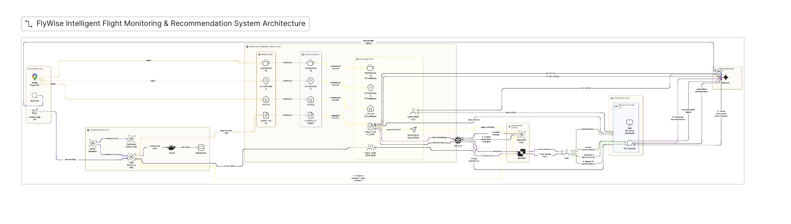
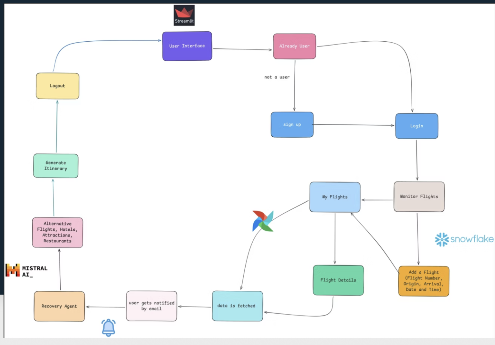

# ✈️ FlywiseAI - Intelligent Flight Delay Recovery System

FlywiseAI is an AI-powered travel assistant that **proactively monitors flight delays** and provides **personalized recovery recommendations** including alternate flights, hotels, restaurants, attractions, and activities based on user preferences.

---

## 🎯 Project Overview

FlywiseAI helps travelers recover from flight disruptions by:
- **Real-time flight monitoring** starting 4 hours before departure
- **Instant delay notifications** when delays exceed user-defined thresholds
- **Personalized recommendations** for hotels, restaurants, and attractions
- **Alternate flight search** with live pricing and booking links
- **Hourly itinerary generation** tailored to user preferences

---

## 🏗️ System Architecture

FlywiseAI is built using an **agent-based architecture** with clear separation between **Notification** and **Recovery** responsibilities.



### Key Components

| Component | Description |
|-----------|-------------|
| **Notification Agent** | Monitors live flight data in Snowflake, detects delay threshold breaches, generates passenger notifications using Snowflake Cortex (Mistral), uses an outbox pattern for reliable delivery |
| **Recovery Agent** | User-facing Streamlit agent activated after delay notification, provides alternate flights, hotels, food, attractions, and airport activities, powered by Snowflake Cortex LLMs and embeddings |
| **Flight Poller (Airflow DAG)** | Apache Airflow DAG that polls flight status APIs every 5 minutes and writes updates to Snowflake |

---

## 🔁 User Flow

The following diagram shows how a user interacts with FlywiseAI from flight monitoring to recovery assistance during delays.



### Flow Summary

1. **Sign Up** → User creates account with travel preferences (spending, cuisine, attractions, personality)
2. **Add Flight** → User enters flight details and delay notification threshold
3. **Monitoring Begins** → System monitors flight starting 4 hours before departure
4. **Delay Detected** → Notification Agent detects delay exceeding threshold
5. **Alert Sent** → User receives delay notification
6. **Recovery Activated** → Recovery Agent assists with:
   - ✈️ Alternate flights with real-time pricing
   - 🏨 Hotel recommendations
   - 🍽️ Restaurant suggestions (based on cuisine preferences)
   - 🎯 Attractions & activities
   - 🛋️ Airport amenities (lounges, shops, food)
   - 📅 Hourly itinerary generation

---

## 🛠️ Tech Stack

| Layer | Technology |
|-------|------------|
| **Database** | Snowflake (Tables, Views, Streams, Tasks) |
| **AI/ML** | Snowflake Cortex AI (Mistral LLM, Arctic Embeddings) |
| **UI** | Snowflake Native Streamlit |
| **Orchestration** | Apache Airflow (Astronomer Runtime) |
| **Flight Data** | AviationEdge API, Kiwi.com API, SerpAPI |
| **Notifications** | Email/SMS via Snowflake External Functions |

---

---

## 🚀 Getting Started

### Prerequisites

- Docker Desktop installed and running
- Astronomer CLI installed (`brew install astro` or [installation guide](https://www.astronomer.io/docs/astro/cli/install-cli))
- Snowflake account with Cortex AI enabled
- API keys for:
  - AviationEdge (flight status)
  - Kiwi.com (alternate flights)
  - SerpAPI (flight search fallback)

### Local Development

1. **Clone the repository**
```bash
   git clone https://github.com/your-org/flywiseai.git
   cd flywiseai
```

2. **Set up environment variables**
```bash
   cp .env.example .env
   # Edit .env with your API keys and Snowflake credentials
```

3. **Start Airflow locally**
```bash
   astro dev start
```
   This spins up five Docker containers:
   - **Postgres** - Airflow's metadata database
   - **Scheduler** - Monitors and triggers tasks
   - **DAG Processor** - Parses DAGs
   - **API Server** - Serves Airflow UI and API
   - **Triggerer** - Triggers deferred tasks

4. **Access the services**
   - Airflow UI: http://localhost:8080 (admin/admin)
   - Postgres: localhost:5432/postgres (postgres/postgres)

5. **Deploy Streamlit app to Snowflake**
```sql
   -- Run in Snowflake worksheet
   CREATE STREAMLIT FLYWISE_APP
   FROM '@FLYWISE_AI_DB.GOLD.STREAMLIT_STAGE'
   MAIN_FILE = 'flywise_app.py';
```

---

## ⚙️ Configuration

### Airflow Variables

Set these in `airflow_settings.yaml` or Airflow UI:

| Variable | Description |
|----------|-------------|
| `SNOWFLAKE_ACCOUNT` | Snowflake account identifier |
| `SNOWFLAKE_USER` | Snowflake username |
| `SNOWFLAKE_PASSWORD` | Snowflake password |
| `SNOWFLAKE_DATABASE` | Database name (e.g., `FLYWISE_AI_DB`) |
| `AVIATION_EDGE_API_KEY` | AviationEdge API key |
| `KIWI_API_KEY` | Kiwi.com Tequila API key |
| `SERP_API_KEY` | SerpAPI key |

### Snowflake Objects

The system uses these Snowflake objects:

| Object | Type | Description |
|--------|------|-------------|
| `GOLD.USER_PROFILES` | Table | User accounts and preferences |
| `GOLD.USER_SUBSCRIPTIONS` | Table | Monitored flights |
| `GOLD.GOLD_FLIGHT_DATA` | Table | Real-time flight status |
| `GOLD.NOTIFICATION_LOG` | Table | Sent notifications |
| `GOLD.HOTELS_GOLD` | Table | Hotel data (1,549 rows, 10 cities) |
| `GOLD.GOLD_RESTAURANTS_ANALYTICS` | Table | Restaurant data (2,292 rows) |
| `GOLD.ATTRACTIONS_GOLD` | Table | Attraction data (851 rows) |
| `GOLD.VIEW_USER_DELAYED_FLIGHTS` | View | Delayed flights per user |

---

## 📊 Data Sources

| Source | Data | Update Frequency |
|--------|------|------------------|
| AviationEdge API | Flight status, delays | Every 5 minutes |
| Kiwi.com API | Alternate flights, pricing | On-demand |
| SerpAPI | Flight search fallback | On-demand |
| Google Places API | Hotels, restaurants, attractions | Pre-loaded |

---

## 🧪 Testing

### Run DAG Tests
```bash
astro dev pytest
```

### Test Flight Monitoring Locally
```bash
# Trigger the flight poller DAG manually
astro dev run dags trigger flight_poller_dag
```

---

## 🚢 Deployment

### Deploy to Astronomer Cloud
```bash
astro deploy
```

### Deploy Streamlit to Snowflake
```sql
PUT file://streamlit/flywise_app.py @FLYWISE_AI_DB.GOLD.STREAMLIT_STAGE AUTO_COMPRESS=FALSE OVERWRITE=TRUE;

ALTER STREAMLIT FLYWISE_APP SET ROOT_LOCATION = '@FLYWISE_AI_DB.GOLD.STREAMLIT_STAGE';
```

---

## 🔧 Troubleshooting

### Port Conflicts
If ports 8080 or 5432 are already in use:
```bash
# Stop existing containers
astro dev stop

# Or change ports in docker-compose.override.yml
```

### Snowflake Connection Issues
```bash
# Test connection
astro dev run connections test snowflake_default
```

### DAG Not Running
```bash
# Check DAG processor logs
astro dev logs dag-processor
```
---

## 👥 Contributors

- Akash Malhotra
- Moinuddin Mohammed
- Nikhil Choudhari

---

## 📄 License

This project is licensed under the MIT License - see the [LICENSE](LICENSE) file for details.

---

## 🙏 Acknowledgments

- [Astronomer](https://www.astronomer.io/) for Apache Airflow managed platform
- [Snowflake](https://www.snowflake.com/) for Cortex AI and data platform
- [Kiwi.com](https://www.kiwi.com/) for flight search API
- [AviationEdge](https://aviation-edge.com/) for flight status data

---

<p align="center">
  Built with ❤️ by the FlywiseAI Team
</p>
