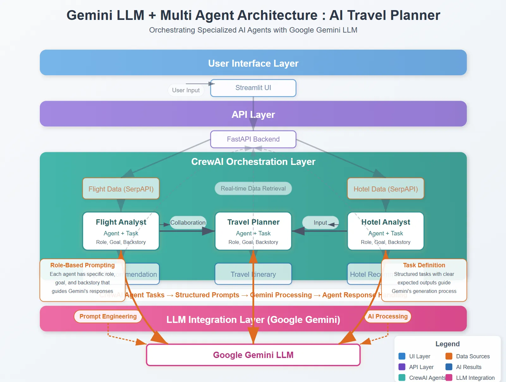

# FlyWise - Personalized AI Travel Planner

An intelligent, persona-driven AI travel planning application using Gemini 2.0 LLM and CrewAI framework. This project demonstrates how AI agents collaborate to create personalized travel experiences tailored to individual preferences, spending power, and travel styles.




## Overview

FlyWise is a multi-agent AI system where specialized agents work together to create comprehensive, personalized travel plans. The system considers your unique travel persona—including your interests, personality type, and spending power—to recommend the perfect flights, hotels, and activities.

Instead of generic recommendations, FlyWise provides:
- **Budget-conscious recommendations** tailored to your spending power (Low/Medium/High)
- **Persona-based customization** matching your travel experience preferences (Adventure, Art History, Food & Culture, etc.)
- **Character-aligned suggestions** suited to your personality (Extrovert, Explorer, Introvert, etc.)
- **Complete trip budget breakdown** with detailed cost estimates

The system leverages:
- **Gemini 2.0 Flash LLM**: Powers intelligent, personalized recommendations
- **CrewAI**: Coordinates multi-agent workflow for comprehensive planning
- **SerpAPI**: Retrieves real-time flight and hotel data
- **FastAPI**: Handles backend API endpoints efficiently
- **Streamlit**: Provides intuitive, user-friendly interface

## Key Features

### 1. Persona-Based Travel Planning
- **Travel Experience Focus**: Choose from Adventure, Art History, Food & Culture, or General
- **Character & Interests**: Tailor recommendations to Extrovert, Introvert, Explorer, or Relaxation Seeker personalities
- **Spending Power Tiers**: Get recommendations matched to Low, Medium, or High budget preferences

### 2. Smart Flight Recommendations
- Retrieves real-time flight data from Google Flights via SerpAPI
- Sorts flights by price for easy comparison
- AI recommends flights based on your spending power:
  - **Low**: Prioritizes cheapest options, accepts longer durations and stops
  - **Medium**: Balances price with reasonable duration and minimal stops
  - **High**: Focuses on premium airlines, shortest duration, and nonstop flights

### 3. Intelligent Hotel Selection
- Searches real-time hotel availability from Google Hotels
- Filters and sorts hotels by price
- AI suggests hotels matching your budget tier and personality:
  - **Low**: Affordable options with acceptable amenities
  - **Medium**: Best value hotels with solid ratings and convenient locations
  - **High**: Luxury hotels with premium amenities and prime locations

### 4. Personalized Itinerary Generation
- Creates day-by-day plans tailored to your interests and personality
- Activity recommendations based on travel experience preference:
  - **Adventure**: Outdoor activities, hiking, adventure sports
  - **Art History**: Museums, galleries, cultural landmarks
  - **Food & Culture**: Local markets, authentic restaurants, food tours
- Social activities matched to your character type (group tours for extroverts, quiet experiences for introverts)
- Budget-appropriate suggestions for dining and transportation

### 5. Comprehensive Budget Breakdown
- Detailed cost analysis at the end of every itinerary
- **Fixed Costs**: Exact flight and hotel expenses
- **Variable Costs**: Estimated daily food, activities, and transportation
- **Total Trip Budget**: Realistic price range for entire journey

### 6. User-Friendly Interface
- Streamlit provides intuitive UI for travel preferences
- Interactive tabs for flights, hotels, AI recommendations, and itinerary
- Persona configuration for personalized results
- Downloadable formatted itinerary


**Enhancements by FlyWise Team:**
- Added persona-based recommendation system
- Implemented spending power-aware flight and hotel selection
- Created character-aligned itinerary generation
- Added comprehensive trip budget calculator
- Optimized for budget-conscious travelers

## Installation

### Prerequisites
- Python 3.8+
- SerpAPI key for fetching real-time flight and hotel data
- Google Gemini API key for AI recommendations

### Setup

1. Clone the repository
```bash
git clone https://github.com/AkashMalhotra2022/GenAI_FlyWise.git
cd GenAI_FlyWise/presentation_demo
```

2. Create and activate a virtual environment
```bash
# Create virtual environment
python -m venv venv

# Activate virtual environment
# On Windows
venv\Scripts\activate
# On macOS/Linux
source venv/bin/activate
```

3. Install dependencies
```bash
pip install -r requirements.txt
```

4. Configure API keys
Set your API keys in the gemini2_travel_v2.py file:
```python
# Load API Keys
GEMINI_API_KEY = os.getenv("GOOGLE_API_KEY", "your_gemini_api_key_here")
SERP_API_KEY = os.getenv("SERP_API_KEY", "your_serpapi_key_here")
```

- Get a Gemini API key from [Google AI Studio](https://makersuite.google.com/)
- Get a SerpAPI key from [SerpAPI](https://serpapi.com/)

## Usage

1. Start the FastAPI backend
```bash
python gemini2_travel_v2.py
```

2. In a new terminal window, start the Streamlit frontend
```bash
streamlit run gemini2_travel_v2_frontend.py
```

3. Open your browser and navigate to http://localhost:8501

4. Configure your travel persona (optional - defaults to Adventure/Extrovert/Medium):
   - **Travel Experience**: Adventure, Art History, Food & Culture, or General
   - **Character & Interests**: Extrovert, Explorer & Extrovert, Introvert, or Relaxation Seeker
   - **Spending Power**: Low, Medium, or High

5. Enter your travel details:
   - Departure and destination airports (IATA codes)
   - Travel dates
   - Select search mode (complete, flights only, or hotels only)

6. Click "Search" and let the AI create your personalized travel plan

7. Review your results:
   - Flight options sorted by price with persona-matched AI recommendations
   - Hotel options with personality-aligned suggestions
   - Day-by-day itinerary customized to your interests
   - Complete trip budget breakdown

## Architecture

### Persona-Driven Multi-Agent System

The application uses a sophisticated AI system with specialized agents that consider your unique travel profile:

1. **Flight Analyst Agent**:
   - Analyzes options based on your spending power tier
   - Recommends cheapest, best value, or premium flights accordingly
   - Considers personality type for duration and convenience preferences
   - Provides detailed reasoning for recommendations

2. **Hotel Analyst Agent**:
   - Evaluates hotels matching your budget tier
   - Highlights locations near attractions relevant to your travel experience
   - Considers character type for social atmosphere and amenities
   - Offers personalized pros and cons analysis

3. **Travel Planner Agent**:
   - Creates itineraries tailored to your interests (adventure, art, food)
   - Suggests activities matching your character type (social vs. quiet)
   - Plans dining and transportation within your spending power
   - Includes budget breakdown with realistic cost estimates

### Project Structure

- `gemini2_travel_v2.py`: FastAPI backend with persona-aware AI agents and API endpoints
- `gemini2_travel_v2_frontend.py`: Streamlit frontend with persona configuration interface
- `requirements.txt`: Project dependencies
- `images/`: Demonstration images and GIFs

## Implementation Highlights

### Persona System
```python
class UserPersona(BaseModel):
    travel_experience: str = "Adventure"  # Adventure, Art History, Food & Culture
    character_interests: str = "Extrovert"  # Extrovert, Introvert, Explorer, Relaxation Seeker
    spending_power: str = "Medium"  # Low, Medium, High
```

### Spending Power Logic
- **Low**: Prioritizes cheapest options, accepts trade-offs
- **Medium**: Seeks best value, balances price with quality
- **High**: Focuses on premium experiences regardless of price

### Budget Calculation
Automatically calculates:
- Fixed costs (flights, hotels)
- Variable costs (food, activities, transportation)
- Daily estimates based on spending power
- Total trip budget range

## Repository

Full source code available at:
[https://github.com/AkashMalhotra2022/GenAI_FlyWise/tree/main/presentation_demo](https://github.com/AkashMalhotra2022/GenAI_FlyWise/tree/main/presentation_demo)

## Contributors

**FlyWise Development Team:**
- **Akash Kumar Malhotra** 
- **Nikhil Narendra Choudhari** 
- **Moinuddin Mohammed** 


## Future Enhancements

- Multi-city trip planning
- Real-time price tracking and alerts
- Integration with booking platforms
- Collaborative trip planning for groups
- Weather-aware activity recommendations
- Visa and travel document assistance

---

**FlyWise** - Travel smarter, not harder. 🛫✨